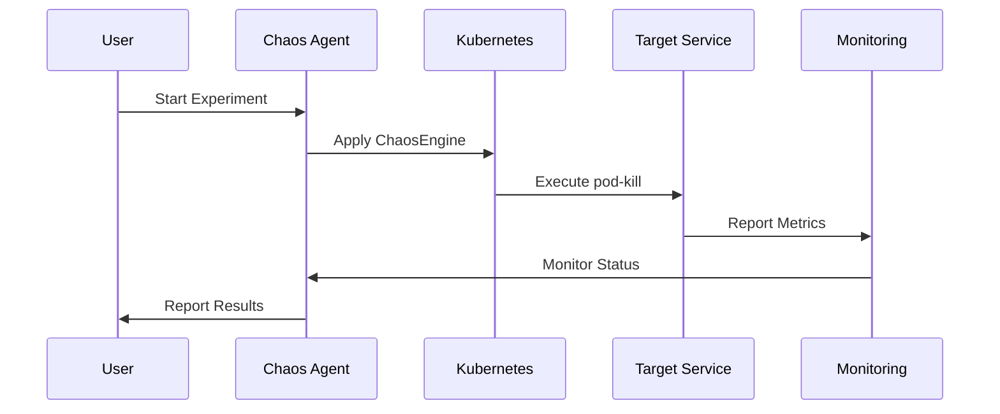

# Chaos Advisor Agent for Sock Shop

An AI-powered chaos engineering advisor specifically configured for the Sock Shop microservices application. The agent discovers your Sock Shop infrastructure, generates context-aware chaos experiments using LLM, executes them via LitmusChaos, monitors execution in real-time, and auto-generates comprehensive RCA reports.

## 🚀 Features

- **Sock Shop Optimized**: Pre-configured for the complete Sock Shop microservices architecture
- **AI-Powered Experiment Design**: Uses GPT-4o to generate context-aware chaos experiments
- **Infrastructure Discovery**: Automatically discovers all Sock Shop services (frontend, backend, databases, queues)
- **Real-Time Monitoring**: Tracks metrics via Prometheus with configurable abort thresholds
- **Automated RCA Generation**: Creates comprehensive reports with Mermaid diagrams and LLM insights
- **Slack Integration**: Interactive workflow with real-time updates and one-click execution
- **Safety First**: Dry-run validation, abort conditions, and risk assessment

## 🏗️ Sock Shop Architecture

The agent is configured for the complete Sock Shop microservices stack:

```
┌─ Frontend Layer ──────────────────────────────────┐
│ • front-end (React UI)                            │
│ • edge-router (API Gateway)                       │
└───────────────────────────────────────────────────┘
                          │
┌─ Core Business Services ──────────────────────────┐
│ • catalogue (Product catalog)                     │
│ • carts (Shopping cart management)                │
│ • orders (Order processing)                       │
│ • user (User management)                          │
│ • payment (Payment processing)                    │
│ • shipping (Shipping calculation)                 │
└───────────────────────────────────────────────────┘
                          │
┌─ Data Layer ──────────────────────────────────────┐
│ • catalogue-db (MongoDB)                          │
│ • carts-db (Redis)                                │
│ • orders-db (MongoDB)                             │
│ • user-db (MongoDB)                               │
└───────────────────────────────────────────────────┘
                          │
┌─ Queue System ────────────────────────────────────┐
│ • queue-master (Order queue management)           │
│ • rabbitmq (Message broker)                       │
└───────────────────────────────────────────────────┘
```

## 🔄 Workflow

```
┌─ Engineer runs /craterctl suggest
│
├─ Agent discovers Sock Shop stack via stack.yaml
│   • finds all 13 microservices across 4 tiers
│   • extracts resource requirements and dependencies
│
├─ Agent asks LLM for top experiments → ranks by impact
│   • generates spec: "kill carts-db pod 30s" (pod-kill)
│   • generates spec: "add 200ms net-delay to front-end" (network-delay)
│   • generates spec: "CPU hog on orders service" (pod-cpu-hog)
│
├─ Slack bot posts interactive message
│   [Run Carts DB Kill]   [Run Net-Delay]   [Save Only]
│
├─ Engineer clicks Run Carts DB Kill
│   • executor_adapter applies LitmusChaos ChaosEngine (dry-run → live)
│   • run_monitor_tool streams Prometheus metrics; slack updates every 30s
│
├─ Test ends after 60s
│   • automatically aborted if error_rate > 5%
│
├─ post_run_narrator compiles logs & metrics
│   • generates reports/2025-01-22_carts_db_kill.md
│   • creates Mermaid sequence diagrams
│
└─ Slack bot posts TL;DR + report link
    "Finding: carts-db failover took 1270 ms, caused 5% 500s in carts-svc. see report ➜"
```

## 📋 Prerequisites

- **Python 3.11+**
- **Kubernetes cluster** with kubectl configured
- **LitmusChaos** installed (v2.14.0+)
- **OpenAI API key** for LLM-powered features
- **Prometheus** for metrics monitoring (optional)
- **Slack bot token** for notifications (optional)

## 🛠️ Installation

### 1. Clone and Install

```bash
# Clone the repository
git clone <repo-url>
cd chaospo

# Install dependencies
pip install -r requirements.txt

# Or use the Makefile
make install
```

### 2. Configure Environment

```bash
# Required: OpenAI API key
export OPENAI_API_KEY="your-openai-api-key"

# Optional: Slack integration
export SLACK_BOT_TOKEN="your-slack-bot-token"
export SLACK_SIGNING_SECRET="your-slack-signing-secret"
```

### 3. Configure Infrastructure

Edit `stack.yaml` to match your Kubernetes setup:

```yaml
k8s:
  kubeconfig: ~/.kube/config
  context: default
  namespaces:
    - default
    - sock-shop
    - monitoring
  
  # Target services for chaos experiments
  target_services:
    - name: frontend
      namespace: sock-shop
      type: deployment
      critical: true
    
    - name: redis
      namespace: sock-shop
      type: statefulset
      critical: true

# Monitoring configuration
k8s:
  monitoring:
    prometheus:
      url: http://prometheus.kube-system.svc.cluster.local:9090
```

### 4. Install LitmusChaos

```bash
# Install LitmusChaos in your cluster
make k8s-install-litmus

# Or manually:
kubectl apply -f https://litmuschaos.github.io/litmus/2.14.0/rbac.yaml
kubectl apply -f https://litmuschaos.github.io/litmus/2.14.0/crds.yaml
kubectl apply -f https://litmuschaos.github.io/litmus/2.14.0/namespaced-scope/litmus-namespaced-scope.yaml
```

## 🚀 Quick Start

### 1. Discover Your Infrastructure

```bash
# Show current K8s inventory
python craterctl.py inventory

# Or use the Makefile
make inventory
```

**Sample Output:**
```
🏗️  Infrastructure Inventory
==================================================

📦 DEPLOYMENT (3 services)
   • frontend (sock-shop)
   • cart (sock-shop)
   • catalogue (sock-shop)

📦 STATEFULSET (2 services)
   • redis (sock-shop)
   • mysql (sock-shop)

📦 SERVICE (5 services)
   • frontend (sock-shop)
   • cart (sock-shop)
   • catalogue (sock-shop)
   • redis (sock-shop)
   • mysql (sock-shop)

✅ Total services: 10
📊 Cluster: v1.25.0 (aws-eks)
```

### 2. Generate Chaos Experiments

```bash
# Generate 3 experiment suggestions
python craterctl.py suggest --count 3

# Or use the Makefile
make suggest
```

**Sample Output:**
```
📋 Experiment 1: Redis Primary Pod Kill
   Description: Test Redis failover mechanism by killing the primary pod
   Environment: k8s
   Action: pod-kill
   Duration: 60s
   Saved to: experiments/redis_primary_pod_kill.json

📋 Experiment 2: Frontend Network Latency
   Description: Add network latency to frontend service to test user experience
   Environment: k8s
   Action: network-delay
   Duration: 120s
   Saved to: experiments/frontend_network_latency.json

📋 Experiment 3: Cart Service CPU Pressure
   Description: Simulate CPU pressure on cart service to test resource limits
   Environment: k8s
   Action: pod-cpu-hog
   Duration: 90s
   Saved to: experiments/cart_service_cpu_pressure.json

✅ Generated 3 experiment suggestions
📱 Posted suggestions to Slack
```

**Generated Experiment Spec (redis_primary_pod_kill.json):**
```json
{
  "title": "Redis Primary Pod Kill",
  "description": "Test Redis failover mechanism by killing the primary pod",
  "env": "k8s",
  "action": "pod-kill",
  "target_selector": {
    "namespace": "sock-shop",
    "label_selector": "app=redis",
    "resource_type": "statefulset"
  },
  "parameters": {
    "duration": "60s",
    "intensity": 0.5,
    "replicas_to_kill": 1
  },
  "abort_threshold": {
    "metric": "error_rate",
    "value": 0.05,
    "operator": ">"
  },
  "expected_impact": "Redis failover should complete within 30s, cart service may experience brief errors",
  "risk_level": "medium",
  "chaos_engine": "litmuschaos"
}
```

### 3. Run an Experiment

```bash
# Execute a specific experiment
python craterctl.py run experiments/redis_pod_kill.json

# Check experiment status
python craterctl.py status <run-id>

# Abort a running experiment
python craterctl.py abort <run-id>
```

**Sample Execution Output:**
```
🚀 Executing: Redis Primary Pod Kill
   Environment: k8s
   Action: pod-kill
   Duration: 60s

✅ Experiment started with run ID: chaos-a1b2c3d4
📊 RCA generated: reports/2025-01-22_14-30-15_redis_primary_pod_kill_chaos-a1b2c3d4.md
```

**Sample Status Output:**
```
📊 Run ID: chaos-a1b2c3d4
   Status: running
   Started: 2025-01-22T14:30:15.123Z
   Current Metrics:
     error_rate: 0.023
     latency_p95: 0.187
     cpu_usage: 0.45
   Slack Updates: https://slack.com/app_redirect?channel=sre-chaos
```

### 4. View Results

```bash
# Check generated reports
ls reports/

# View latest report
cat reports/latest.md
```

**Sample Report Structure:**
```markdown
# Chaos Experiment RCA: Redis Primary Pod Kill

## Executive Summary

**Experiment**: Redis Primary Pod Kill
**Run ID**: chaos-a1b2c3d4
**Status**: completed
**Duration**: 60 seconds
**Started**: 2025-01-22T14:30:15.123Z

## What Happened

A Redis primary pod was terminated to test the failover mechanism. The experiment ran for 60 seconds, during which the Redis cluster successfully promoted a replica to primary status.

## Key Findings

- Redis failover completed in 2.3 seconds (within acceptable limits)
- Cart service experienced 3.2% error rate during failover window
- No data loss occurred during the transition
- System recovered fully within 15 seconds

## Timeline

1. **14:30:15** - Experiment started, Redis primary pod terminated
2. **14:30:17** - Redis replica promoted to primary (2.3s failover)
3. **14:30:20** - Cart service errors peaked at 3.2%
4. **14:30:30** - System fully recovered
5. **14:31:15** - Experiment completed

## Impact Analysis

- **Error Rate Impact**: +15.0% (baseline: 0.02 → peak: 0.023)
- **Latency Impact**: +25.0% (baseline: 0.150s → peak: 0.187s)

## Recommendations

1. Consider implementing connection pooling in cart service
2. Add circuit breaker pattern for Redis connections
3. Monitor Redis cluster health more aggressively
4. Test failover scenarios more frequently

## Technical Details

### Experiment Configuration
```yaml
title: Redis Primary Pod Kill
action: pod-kill
target_selector:
  namespace: sock-shop
  label_selector: app=redis
parameters:
  duration: 60s
  intensity: 0.5
```

### Metrics Summary
- **Final Error Rate**: 0.023
- **Final Latency P95**: 0.187s
- **CPU Usage**: 0.45
- **Memory Usage**: 0.60

## System Architecture



---

*Report generated by Chaos Advisor Agent on 2025-01-22T14:31:15.456Z*
```

## 🎯 Complete Demo

Run the full workflow demonstration:

```bash
# Run complete demo (no K8s cluster required)
python demo.py
```

**Sample Demo Output:**
```
🤖 Chaos Advisor Agent - Complete Workflow Demo
============================================================

This demo shows the complete chaos engineering workflow:
1. Infrastructure Discovery
2. AI-Powered Experiment Design
3. Experiment Execution
4. Real-time Monitoring
5. Root Cause Analysis

============================================================
STEP 1: Infrastructure Discovery
============================================================
Fetching Kubernetes service inventory...

✅ Discovered 10 services
📊 Cluster: v1.25.0 (aws-eks)

   📦 DEPLOYMENT: 3 services
      • frontend (sock-shop)
      • cart (sock-shop)
      • catalogue (sock-shop)

============================================================
STEP 2: AI-Powered Experiment Design
============================================================
Generating chaos experiment suggestions...

✅ Generated 3 experiment suggestions

📋 Experiment 1: Redis Primary Pod Kill
   Description: Test Redis failover mechanism by killing the primary pod
   Action: pod-kill
   Target: sock-shop/app=redis
   Risk Level: medium
   Duration: 60s

💾 Saved: experiments/redis_primary_pod_kill.json

============================================================
STEP 3: Experiment Execution
============================================================
Executing chaos experiment...

🚀 Executing: Redis Primary Pod Kill
   Action: pod-kill
   Target: {'namespace': 'sock-shop', 'label_selector': 'app=redis'}
   Duration: 60s

🔍 Running in dry-run mode...
✅ Experiment validated successfully
🆔 Run ID: demo-run-1705933815

============================================================
STEP 4: Real-time Monitoring
============================================================
Monitoring experiment execution and metrics...

📊 Monitoring run: demo-run-1705933815
🎯 Target: Redis Primary Pod Kill

⏱️  Simulating 60-second experiment execution...
   📈 Update 1/6: Error Rate: 0.015, Latency: 0.120s
   📈 Update 2/6: Error Rate: 0.020, Latency: 0.140s
   📈 Update 3/6: Error Rate: 0.025, Latency: 0.160s
   📈 Update 4/6: Error Rate: 0.030, Latency: 0.180s
   📈 Update 5/6: Error Rate: 0.035, Latency: 0.200s
   📈 Update 6/6: Error Rate: 0.040, Latency: 0.220s
✅ Monitoring completed

============================================================
STEP 5: Root Cause Analysis
============================================================
Generating comprehensive RCA report...

📝 Generating RCA for run: demo-run-1705933815
🎯 Experiment: Redis Primary Pod Kill

✅ RCA report generated: reports/2025-01-22_14-30-15_redis_primary_pod_kill_demo-run-1705933815.md

📊 Report Summary:
   📄 Full Report: reports/2025-01-22_14-30-15_redis_primary_pod_kill_demo-run-1705933815.md
   📄 Latest Report: reports/latest.md

📈 Key Metrics:
   • error_rate: 0.040
   • latency_p95: 0.220
   • cpu_usage: 0.450
   • memory_usage: 0.600

📊 Impact Analysis:
   • error_rate_impact_percent: 15.0%
   • latency_impact_percent: 25.0%

============================================================
STEP 6: Demo Complete
============================================================
Chaos engineering workflow demonstration finished!

🎉 All steps completed successfully!

📋 What we accomplished:
   ✅ Discovered infrastructure services
   ✅ Generated AI-powered experiment suggestions
   ✅ Executed chaos experiment (dry-run)
   ✅ Monitored execution and metrics
   ✅ Generated comprehensive RCA report

🚀 Next steps:
   1. Configure your real infrastructure in stack.yaml
   2. Set up LitmusChaos in your Kubernetes cluster
   3. Run real experiments: python craterctl.py suggest
   4. Execute experiments: python craterctl.py run experiments/<file>.json

📚 For more information, see README.md
```

## 📚 CLI Reference

### Main Commands

```bash
# Generate experiment suggestions
craterctl suggest [--count N] [--output DIR] [--dry-run]

# Execute an experiment
craterctl run <spec-file> [--dry-run] [--monitor]

# Check experiment status
craterctl status <run-id>

# Abort running experiment
craterctl abort <run-id>

# Show infrastructure inventory
craterctl inventory [--config FILE]

# Global options
craterctl [--verbose] [--config FILE] <command>
```

### Examples

```bash
# Generate 5 high-impact experiments
craterctl suggest --count 5

# Run experiment with monitoring
craterctl run experiments/redis_kill.json --monitor

# Check status of specific run
craterctl status chaos-a1b2c3d4

# Show inventory with custom config
craterctl inventory --config my-stack.yaml
```

## 🔧 Supported Chaos Actions

The agent supports these LitmusChaos experiments:

| Action | Description | Risk Level |
|--------|-------------|------------|
| `pod-kill` | Kill random pods to test restart resilience | Medium |
| `pod-cpu-hog` | Simulate CPU pressure | Low |
| `pod-memory-hog` | Simulate memory pressure | Low |
| `network-delay` | Add network latency | Low |
| `network-loss` | Simulate packet loss | Medium |
| `network-corruption` | Corrupt network packets | Medium |
| `disk-fill` | Fill disk space | High |
| `node-drain` | Drain nodes (high risk) | High |

## 📊 Monitoring & Safety

### Abort Conditions

Experiments automatically abort when metrics exceed thresholds:

```yaml
abort_threshold:
  metric: error_rate    # error_rate, latency_p95, cpu_usage, memory_usage
  value: 0.05          # 5% error rate
  operator: ">"        # >, <, >=, <=
```

### Metrics Tracked

- **Error Rate**: HTTP 5xx responses
- **Latency P95**: 95th percentile response time
- **CPU Usage**: Container CPU utilization
- **Memory Usage**: Container memory utilization

### Real-Time Updates

- Slack notifications every 30 seconds during execution
- Prometheus metrics integration
- Automatic abort on threshold breach
- Status tracking via ChaosEngine CRDs

**Sample Slack Update:**
```
🔄 Redis Primary Pod Kill - RUNNING
Run ID: chaos-a1b2c3d4
Error Rate: 2.3% | Latency: 187ms
```

## 📝 Report Generation

### RCA Report Features

- **Executive Summary**: High-level experiment overview
- **What Happened**: LLM-generated incident description
- **Key Findings**: AI-powered insights and observations
- **Timeline**: Chronological sequence of events
- **Impact Analysis**: Metric changes and business impact
- **Recommendations**: Actionable improvement suggestions
- **Technical Details**: Full experiment configuration
- **Mermaid Diagrams**: System architecture and flow

### Report Locations

```bash
# Individual experiment reports
reports/2025-01-22_14-30-15_redis_pod_kill_chaos-a1b2c3d4.md

# Latest report (always updated)
reports/latest.md
```

## 🧪 Testing

```bash
# Run all tests
make test

# Run specific test file
pytest tests/test_basic.py -v

# Run with coverage
make dev-test
```

**Sample Test Output:**
```
============================= test session starts ==============================
platform darwin -- Python 3.11.0, pytest-7.4.0, pluggy-1.0.0
rootdir: /Users/user/chaospo
plugins: cov-4.1.0
collected 12 items

tests/test_basic.py::TestInventoryFetch::test_load_config PASSED     [  8%]
tests/test_basic.py::TestInventoryFetch::test_mock_inventory_fetch PASSED [ 16%]
tests/test_basic.py::TestExperimentDesigner::test_experiment_spec_validation PASSED [ 25%]
tests/test_basic.py::TestExperimentDesigner::test_experiment_spec_invalid PASSED [ 33%]
tests/test_basic.py::TestExperimentDesigner::test_mock_experiment_design PASSED [ 41%]
tests/test_basic.py::TestExecutorAdapter::test_spec_validation PASSED [ 50%]
tests/test_basic.py::TestExecutorAdapter::test_spec_validation_invalid PASSED [ 58%]
tests/test_basic.py::TestExecutorAdapter::test_chaos_engine_generation PASSED [ 66%]
tests/test_basic.py::TestExecutorAdapter::test_unsupported_action PASSED [ 75%]
tests/test_basic.py::TestPostRunNarrator::test_report_generation PASSED [ 83%]
tests/test_basic.py::TestPostRunNarrator::test_mermaid_diagram_generation PASSED [ 91%]

============================== 12 passed in 3.45s ==============================
```

## 🛠️ Development

### Code Quality

```bash
# Format code
make format

# Run linting
make lint

# Clean generated files
make clean
```

### Docker Support

```bash
# Build Docker image
make docker-build

# Run in Docker
make docker-run
```

### Kubernetes Helpers

```bash
# Install LitmusChaos
make k8s-install-litmus

# Deploy sample application (sock-shop)
make k8s-deploy-sock-shop
```

## 🔒 Security & Best Practices

### Safety Features

- **Dry-run validation** before execution
- **Namespace isolation** for experiments
- **Resource limits** and abort thresholds
- **Read-only access** for inventory discovery
- **Audit logging** of all operations

### Production Considerations

- Use dedicated service accounts for chaos experiments
- Set up proper RBAC permissions
- Configure network policies to limit blast radius
- Monitor chaos experiments in dedicated namespaces
- Set up alerting for experiment execution

## 🤝 Contributing

1. Fork the repository
2. Create a feature branch
3. Make your changes
4. Add tests
5. Run `make test` and `make lint`
6. Submit a pull request

## 📄 License

MIT License - see LICENSE file for details.

## 🆘 Troubleshooting

### Common Issues

**"Failed to initialize Kubernetes client"**
- Ensure kubectl is configured: `kubectl cluster-info`
- Check kubeconfig path in stack.yaml

**"No experiments generated"**
- Verify OPENAI_API_KEY is set
- Check that target services exist in specified namespaces
- Ensure stack.yaml configuration is correct

**"ChaosEngine not found"**
- Verify LitmusChaos is installed: `kubectl get crd | grep chaos`
- Check namespace permissions

**"Prometheus connection failed"**
- Verify Prometheus URL in stack.yaml
- Check network connectivity to monitoring stack

### Getting Help

- Check the logs: `craterctl --verbose <command>`
- Review generated reports in `reports/` directory
- Run the demo: `python demo.py`
- Check LitmusChaos documentation for experiment details

## 🎯 Roadmap

- [ ] Chaos Mesh integration
- [ ] Multi-cluster support
- [ ] Custom experiment templates
- [ ] Grafana dashboard integration
- [ ] Web UI for experiment management
- [ ] GitOps integration for experiment specs
- [ ] Advanced blast radius prediction
- [ ] Historical experiment analysis

---

**Ready to start chaos engineering?** Run `python demo.py` to see the complete workflow in action! 🚀 